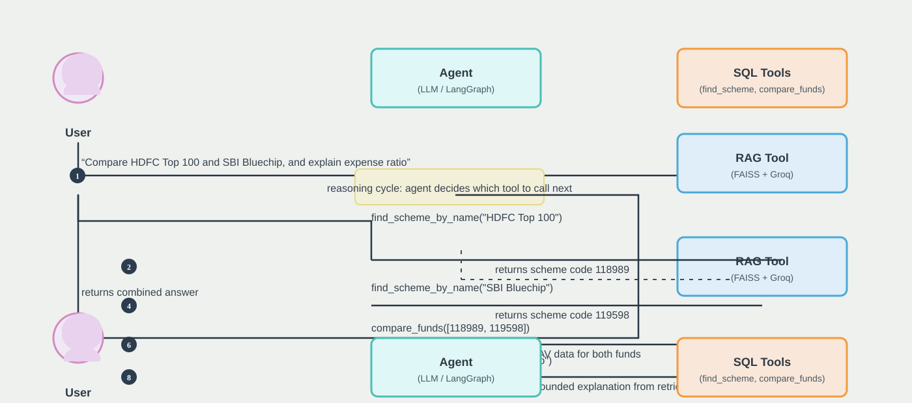

# 💼 Wealth Management Intelligence Assistant

> An end-to-end data pipeline and AI-powered assistant for Indian mutual fund analysis — starting from raw AMFI NAV data and building toward intelligent portfolio insights.

---

## 📌 Project Overview

This project aims to build a **Wealth Management Intelligence Assistant** that ingests, cleans, and analyzes daily Net Asset Value (NAV) data published by the **Association of Mutual Funds in India (AMFI)**. The long-term vision is to layer AI/LLM-based intelligence on top of structured fund data to provide actionable portfolio recommendations and fund comparisons.

## 🧠 Agent Architecture



---

## ✅ Work Done So Far

### Phase 1 — Data Acquisition & Ingestion

**Script:** [`scraper.py`](./scraper.py)

A robust data scraper that fetches the daily NAV dataset directly from the AMFI public endpoint.

**What it does:**
- Sends an authenticated HTTP request (with a realistic `User-Agent` header) to `https://www.amfiindia.com/spages/NAVAll.txt`
- Handles all common network failure modes gracefully:
  - `HTTPError` — bad status codes
  - `ConnectionError` — no internet / DNS failure
  - `Timeout` — server took too long to respond
- Saves the raw `.txt` response to `data/raw/` with a **date-stamped filename** (e.g., `nav_raw_20260822.txt`)
- Prints a preview of the first 5 lines for quick sanity-checking

**Raw data collected:**

| File | Size |
|------|------|
| `nav_raw_20260818.txt` | ~1.67 MB |
| `nav_raw_20260822.txt` | ~1.52 MB |

---

### Phase 2 — Data Cleaning & Transformation

**Notebook:** [`clean_nav_data.ipynb`](./clean_nav_data.ipynb)

A fully executed Jupyter notebook that parses, cleans, and exports the raw AMFI text into a structured, analysis-ready CSV.

**What it does:**

| Step | Description |
|------|-------------|
| **Load** | Auto-detects and loads the most recent raw `.txt` file from `data/raw/` |
| **Inspect** | Prints the first 30 raw lines using `repr()` to understand the exact format |
| **Filter** | Uses `is_data_row()` to keep only lines that start with a numeric scheme code and have ≥ 6 semicolon-separated fields |
| **Parse** | Uses `parse_row()` to extract: `scheme_code`, `isin_growth`, `is_reinvest`, `scheme_name`, `nav`, `nav_date` — robust to variable column counts |
| **Type Cast** | Converts `nav` to `float64` using `pd.to_numeric(..., errors='coerce')` |
| **Date Parse** | Converts `nav_date` to `datetime64` using `pd.to_datetime(..., format='%d-%b-%Y', errors='coerce')` |
| **Validate** | Checks for bad/missing NAV values before dropping — result: **0 bad rows** |
| **Deduplicate** | Drops NaN and duplicate rows |
| **Export** | Saves clean data to `data/clean/nav_clean_<YYYYMMDD>.csv` |

**Cleaning results from latest run:**

```
Total raw lines   : 35,734
Data rows kept    : 14,282
Header/junk lines : 21,452  (dropped)
Bad NAV values    : 0
Final clean rows  : 14,282
```

**Clean output schema:**

| Column | Type | Description |
|--------|------|-------------|
| `scheme_code` | `object` | Unique AMFI scheme identifier |
| `isin_growth` | `object` | ISIN for growth / dividend payout option |
| `is_reinvest` | `object` | ISIN for dividend reinvestment option (`-` if N/A) |
| `scheme_name` | `object` | Full fund name including plan and option |
| `nav` | `float64` | Net Asset Value (numeric) |
| `nav_data` | `object` | Raw date string (e.g., `21-Aug-2026`) |
| `nav_date` | `datetime64[ns]` | Parsed date for time-series operations |

**Clean data files produced:**

| File | Size |
|------|------|
| `nav_clean_20260822.csv` | ~1.57 MB |
| `nav_clean_20260825.csv` | ~1.57 MB |

---

### Phase 3 — Repository Hygiene

**File:** [`.gitignore`](./.gitignore)

A comprehensive `.gitignore` set up to:
- Exclude Python bytecode, virtual environments, and build artifacts
- Exclude Jupyter checkpoint files
- **Keep raw `.txt` and large data files out of version control** (tracked by filename pattern)
- Exclude API keys, secrets, `.env` files
- Exclude generated model artifacts (`.pkl`, `.h5`, `.joblib`)
- Exclude the `inspect_cells.py` scratch/helper script

---

### Utilities

**Script:** [`inspect_cells.py`](./inspect_cells.py) *(dev-only, gitignored)*

A lightweight debug utility that reads the notebook as JSON and prints each code cell's source and execution status — useful for verifying notebook state without launching Jupyter.

---

## 📁 Project Structure

```
Wealth Management Intelligence Assistant/
│
├── scraper.py                  # Fetches daily NAV data from AMFI
├── clean_nav_data.ipynb        # Cleans and exports structured CSV from raw data
├── inspect_cells.py            # Dev utility — inspect notebook cells (gitignored)
├── .gitignore                  # Git exclusion rules
│
└── data/
    ├── raw/                    # Raw .txt files from AMFI (gitignored)
    │   ├── nav_raw_20260818.txt
    │   └── nav_raw_20260822.txt
    └── clean/                  # Cleaned, analysis-ready CSVs
        ├── nav_clean_20260822.csv
        └── nav_clean_20260825.csv
```

---

## 🛠️ Tech Stack

| Tool | Purpose |
|------|---------|
| **Python 3.10** | Core language |
| **requests** | HTTP scraping with error handling |
| **pandas** | Data parsing, cleaning, transformation |
| **Jupyter Notebook** | Interactive EDA and pipeline development |
| **glob / os / datetime** | File discovery, path management, date stamping |

---

## 🚀 How to Run

### 1. Set up the environment

```bash
pip install requests pandas jupyter fastapi uvicorn streamlit python-dotenv langchain langchain-core langchain-groq faiss-cpu sentence-transformers
```

> Make sure your `.env` file contains the required keys, especially `GROQ_API_KEY`.

### 2. Start the backend

```bash
python -m uvicorn api.main:app --host 0.0.0.0 --port 8000
```

This starts the FastAPI backend at:
- `http://localhost:8000/health`
- `http://localhost:8000/chat`

### 3. Start the frontend

```bash
python -m streamlit run ui/app.py --server.port 8501 --server.address localhost
```

Open the app here:
- `http://localhost:8501`

### 4. Fetch fresh NAV data

```bash
python scraper.py
```

This saves a new `data/raw/nav_raw_<today>.txt` file.

### 5. Clean and export

Open and run all cells in `clean_nav_data.ipynb`. The notebook auto-detects the latest raw file and exports a clean CSV to `data/clean/`.

---

## 🧩 Current app flow

The project now runs as a full stack:

- **Frontend:** Streamlit UI for chat interactions
- **Backend:** FastAPI server that calls the LangGraph agent
- **Agent:** ReAct-style mutual fund assistant with tool use for fund lookup, comparison, trends, and concept questions
- **Data layer:** AMFI NAV raw data, cleaned CSVs, and local RAG/document retrieval

This gives a working end-to-end experience from scraping and cleaning fund data to asking the assistant questions in the browser.

---

## 🗺️ Roadmap

- [ ] **Phase 4** — Exploratory Data Analysis (EDA): fund category distribution, NAV statistics, top performers
- [ ] **Phase 5** — Historical NAV tracking: multi-day delta computation, trend detection
- [ ] **Phase 6** — LLM Integration: natural language queries over fund data (LangChain / Gemini)
- [ ] **Phase 7** — Portfolio Intelligence: allocation recommendations, risk scoring, peer comparison
- [ ] **Phase 8** — Dashboard / UI: interactive web interface for fund search and portfolio tracking

---

## 📄 Data Source

All NAV data is sourced from the **Association of Mutual Funds in India (AMFI)** public endpoint:

> 🔗 `https://www.amfiindia.com/spages/NAVAll.txt`

This data is updated daily on business days and is freely available in the public domain.

---

*Last updated: August 2026*
